# EF — Reporte de Proyecto
**Estudiante:** Alejandro Ramirez
**Proyecto:** Ecommerce
**Repositorio:** https://github.com/alejandroramirezucb/proyecto1-isw-213
**Fecha de entrega:** 20/06/2026

---

## Sección 1 — Deploy

**URL del proyecto:** https://raidencenter.onrender.com/
**Swagger / API:** https://raidencenter.onrender.com/api-docs/

> Captura del proyecto corriendo con datos reales:

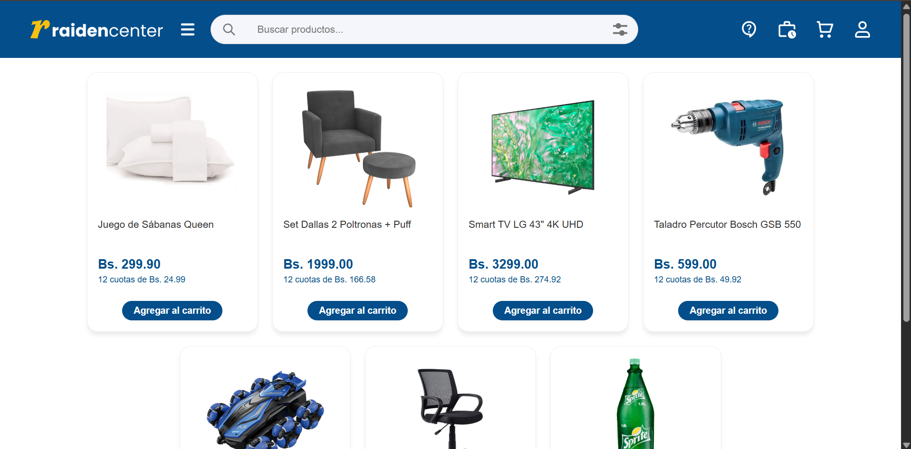

> Captura de la documentación de API (Swagger):

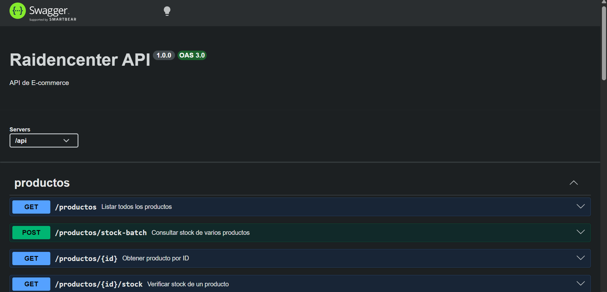

---

## Sección 2 — Pruebas con TDD + cobertura

### Cobertura inicial (0%)

**Herramienta:** Vitest + @vitest/coverage-v8 (provider v8)

> Captura del reporte de cobertura antes de escribir pruebas nuevas:

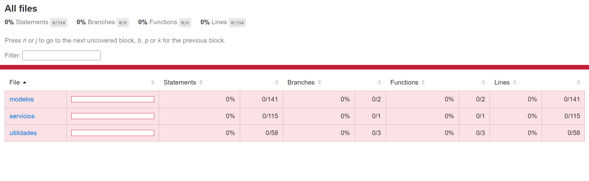

---

### Ciclo TDD — Prueba 1

**HU:** HU-02 Pago flexible por cuotas
> Como cliente, quiero seleccionar la opción de pago en cuotas al finalizar mi compra para adquirir productos de mayor valor sin tener el dinero suficiente en ese momento.

**CA elegido:** Dado que el cliente está en la pasarela de pagos, cuando seleccione "Pago en cuotas", entonces el sistema debe mostrar el monto de cada cuota y el interés (si existe) antes de confirmar.

**Commit 1 — Rojo** [`1a305e6`](https://github.com/alejandroramirezucb/proyecto1-isw-213/commit/1a305e6):
```
test: [HU-02] agregar test de cuota con interes para pago flexible
```
Test escrito (sin el código que lo pase aún):
```javascript
import { describe, it, expect } from 'vitest';
import CalculadorPrecio from '../../../cliente/utilidades/CalculadorPrecio.js';

describe('HU-02 CalculadorPrecio.calcularCuotaConInteres', () => {
  it('aplica el interés al total antes de dividir entre las cuotas', () => {
    // Arrange: precio = 1000, numeroCuotas = 10, interes = 0.2 
    // Act
    const resultado = CalculadorPrecio.calcularCuotaConInteres(1000, 10, 0.2);

    // Assert
    expect(resultado).toBe('120.00');
  });

  it('equivale a la cuota simple cuando el interés es cero', () => {
    // Arrange: precio = 1200, numeroCuotas = 12, interes = 0 
    // Act
    const resultado = CalculadorPrecio.calcularCuotaConInteres(1200, 12, 0);

    // Assert
    expect(resultado).toBe('100.00');
  });
});
```

> Captura del test fallando:

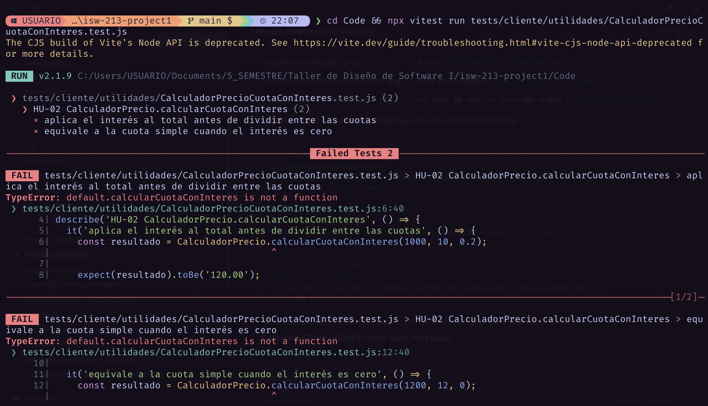

---

**Commit 2 — Verde** [`e614996`](https://github.com/alejandroramirezucb/proyecto1-isw-213/commit/e614996):
```
feat: [HU-02] implementar calcularCuotaConInteres
```
Código mínimo para hacer pasar el test:
```javascript
static calcularCuotaConInteres(precio, numeroCuotas, interes) {
  const total = precio * (1 + interes);
  return (total / numeroCuotas).toFixed(2);
}
```

> Captura del test pasando:

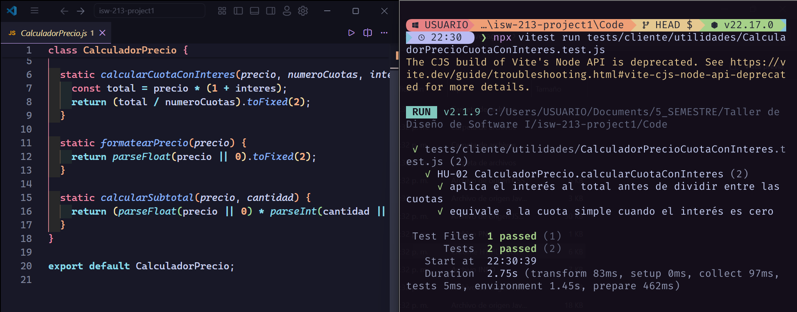

---

**Commit 3 — Refactor** [`63cb35b`](https://github.com/alejandroramirezucb/proyecto1-isw-213/commit/63cb35b):
```
refactor: [HU-02] reutilizar calcularCuotas en calcularCuotaConInteres
```
Cambios aplicados:
```javascript
static calcularCuotaConInteres(precio, numeroCuotas, interes) {
  return CalculadorPrecio.calcularCuotas(
    precio * (1 + interes),
    numeroCuotas,
  );
}
```

> Captura del test aún pasando después del refactor:

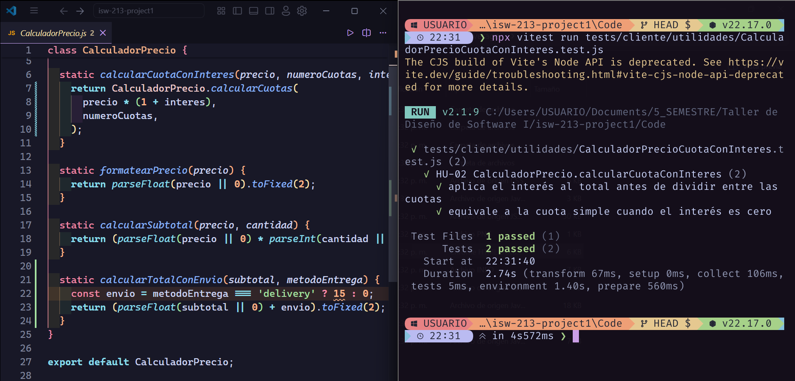

---

### Ciclo TDD — Prueba 2

**HU:** HU-12 Alerta de Stock Mínimo
> Como administrador, quiero recibir notificaciones automáticas cuando un producto tenga pocas unidades en el stock para realizar la reposición a tiempo y no perder ventas.

**CA elegido:** Dado que el inventario disminuye por cada venta, cuando el stock llegue a una cantidad, entonces el sistema debe enviar un correo o alerta al panel de administración.

**Commit 1 — Rojo** [`67628ed`](https://github.com/alejandroramirezucb/proyecto1-isw-213/commit/67628ed):
```
test: [HU-12] agregar test de alerta de stock minimo
```
Test escrito (sin el código que lo pase aún):
```javascript
import { describe, it, expect } from 'vitest';
import GestorStock from '../../../cliente/utilidades/GestorStock.js';

describe('GestorStock', () => {
  describe('HU-12 requiere reposicion', () => {
    it('marca reposición cuando el stock está en el umbral', () => {
      // Arrange: stock = 5, umbral = 5 
      // Act
      const resultado = GestorStock.requiereReposicion(5, 5);

      // Assert
      expect(resultado).toBe(true);
    });

    it('marca reposición cuando el stock está por debajo del umbral', () => {
      // Arrange: stock = 2, umbral = 5
      // Act
      const resultado = GestorStock.requiereReposicion(2, 5);

      // Assert
      expect(resultado).toBe(true);
    });

    it('no marca reposición cuando el stock supera el umbral', () => {
      // Arrange: stock = 8, umbral = 5 
      // Act
      const resultado = GestorStock.requiereReposicion(8, 5);

      // Assert
      expect(resultado).toBe(false);
    });

    it('usa el umbral por defecto cuando no se especifica', () => {
      // Arrange: stock = 5
      // Act
      const resultado = GestorStock.requiereReposicion(5);

      // Assert
      expect(resultado).toBe(true);
    });
  });
});
```

> Captura del test fallando:

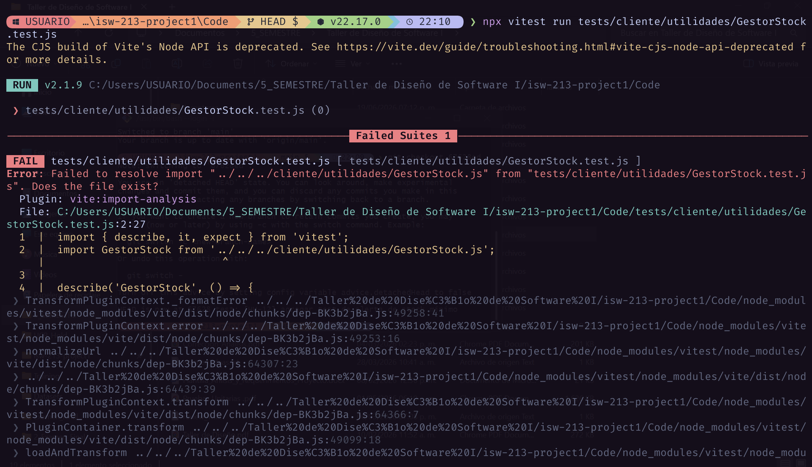

---

**Commit 2 — Verde** [`32caca5`](https://github.com/alejandroramirezucb/proyecto1-isw-213/commit/32caca5):
```
feat: [HU-12] implementar GestorStock.requiereReposicion
```
Código mínimo:
```javascript
class GestorStock {
  static requiereReposicion(stock, umbral = 5) {
    return stock <= umbral;
  }
}

export default GestorStock;
```

> Captura del test pasando:

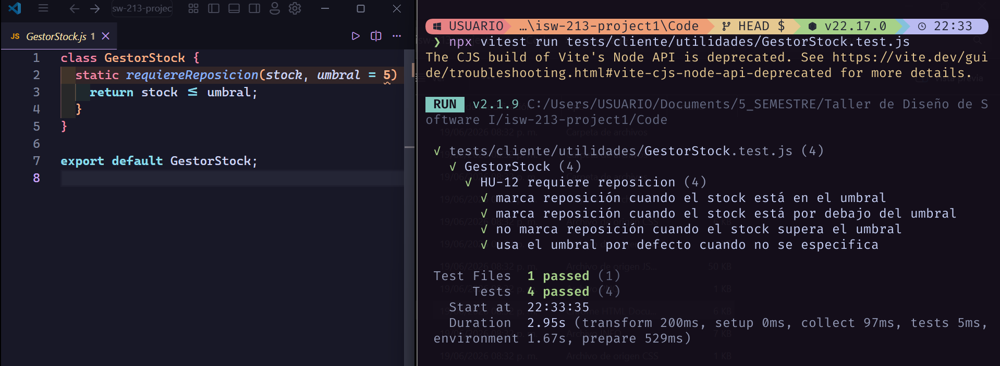

---

**Commit 3 — Refactor** [`bce3e5f`](https://github.com/alejandroramirezucb/proyecto1-isw-213/commit/bce3e5f):
```
refactor: [HU-12] extraer constante UMBRAL_REPOSICION_DEFECTO
```
Cambios aplicados:
```javascript
const UMBRAL_REPOSICION_DEFECTO = 5;

class GestorStock {
  static requiereReposicion(stock, umbral = UMBRAL_REPOSICION_DEFECTO) {
    return stock <= umbral;
  }
}

export default GestorStock;
```

> Captura del test aún pasando después del refactor:

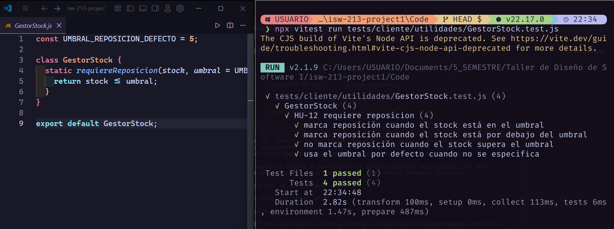

---

### Ciclo TDD — Prueba 3

**HU:** HU-03 Solicitud de devolución
> Como cliente, quiero solicitar la devolución de un producto dentro de las 24 horas para obtener un reembolso cumpliendo con las políticas de Raiden Corp. (factura y producto intacto).

**CA elegido:** 
- Dado que han pasado menos de 24 horas desde la entrega, cuando el cliente entre a su pedido, entonces el botón "Solicitar Devolución" debe estar activo y exigir que se adjunte una foto de la factura. 
- Dado que han pasado más de 24 horas, cuando el cliente entre a su pedido, entonces el sistema debe deshabilitar automáticamente la opción de devolución, indicando que el plazo ha vencido.

**Commit 1 — Rojo** [`1068f6c`](https://github.com/alejandroramirezucb/proyecto1-isw-213/commit/1068f6c):
```
test: [HU-03] agregar test de plazo de 24h para solicitud de devolucion
```
Test escrito (la clase `GestorDevoluciones` no existe aún):
```javascript
import { describe, it, expect } from 'vitest';
import GestorDevoluciones from '../../../cliente/utilidades/GestorDevoluciones.js';

describe('GestorDevoluciones', () => {
  describe('HU-03 puede solicitar devolucion', () => {
    it('permite la devolución cuando han pasado menos de 24 horas desde la entrega', () => {
      // Arrange
      const entrega = new Date('2026-06-19T08:00:00Z');
      const ahora = new Date('2026-06-19T18:00:00Z');

      // Act
      const resultado = GestorDevoluciones.puedeSolicitar(entrega, ahora);

      // Assert
      expect(resultado).toBe(true);
    });

    it('rechaza la devolución cuando han pasado más de 24 horas desde la entrega', () => {
      // Arrange
      const entrega = new Date('2026-06-18T08:00:00Z');
      const ahora = new Date('2026-06-19T14:00:00Z');

      // Act
      const resultado = GestorDevoluciones.puedeSolicitar(entrega, ahora);

      // Assert
      expect(resultado).toBe(false);
    });

    it('rechaza la devolución cuando han pasado exactamente 24 horas', () => {
      // Arrange
      const entrega = new Date('2026-06-18T08:00:00Z');
      const ahora = new Date('2026-06-19T08:00:00Z');

      // Act
      const resultado = GestorDevoluciones.puedeSolicitar(entrega, ahora);

      // Assert
      expect(resultado).toBe(false);
    });
  });
});
```

> Captura del test fallando:

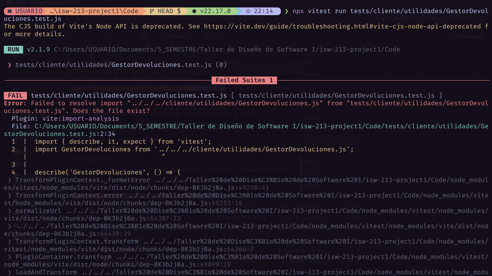

---

**Commit 2 — Verde** [`edbb12d`](https://github.com/alejandroramirezucb/proyecto1-isw-213/commit/edbb12d):
```
feat: [HU-03] implementar GestorDevoluciones.puedeSolicitar
```
Código mínimo para hacer pasar el test:
```javascript
class GestorDevoluciones {
  static puedeSolicitar(fechaEntrega, ahora) {
    const transcurridoMs = ahora - fechaEntrega;
    return transcurridoMs < 24 * 60 * 60 * 1000;
  }
}

export default GestorDevoluciones;
```

> Captura del test pasando:

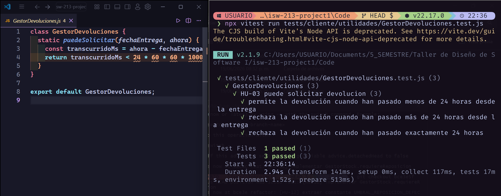

---

**Commit 3 — Refactor** [`40852a7`](https://github.com/alejandroramirezucb/proyecto1-isw-213/commit/40852a7):
```
refactor: [HU-03] extraer constante LIMITE_DEVOLUCION_MS
```
Cambios aplicados:
```javascript
const SEGUNDO_MS = 1000;
const MINUTO_MS = 60 * SEGUNDO_MS;
const HORA_MS = 60 * MINUTO_MS;
const LIMITE_DEVOLUCION_MS = 24 * HORA_MS;

class GestorDevoluciones {
  static puedeSolicitar(fechaEntrega, ahora) {
    return (ahora - fechaEntrega) < LIMITE_DEVOLUCION_MS;
  }
}

export default GestorDevoluciones;
```

> Captura del test aún pasando después del refactor:

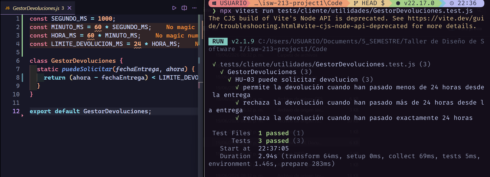

---

### Cobertura final

**Cobertura alcanzada:** 98.77% statements / 95.74% ramas / 100% funciones / 98.77% líneas, con 56 pruebas verdes.

| Archivo / paquete | % Stmts | % Branch | % Funcs | % Lines |
|---|---|---|---|---|
| Todos los archivos | 98.77 | 95.74 | 100 | 98.77 |
| cliente/utilidades/CalculadorPrecio.js | 100 | 90.9 | 100 | 100 |
| cliente/utilidades/ActualizadorContador.js | 100 | 100 | 100 | 100 |
| cliente/utilidades/GestorStock.js | 100 | 100 | 100 | 100 |
| cliente/utilidades/GestorDevoluciones.js | 100 | 100 | 100 | 100 |
| cliente/servicios/CarritoServicio.js | 100 | 100 | 100 | 100 |
| cliente/modelos/ModeloPedido.js | 100 | 100 | 100 | 100 |
| cliente/modelos/ModeloCarrito.js | 95.69 | 88.46 | 100 | 95.69 |

> Captura del reporte de cobertura final (`Code/coverage/index.html`):

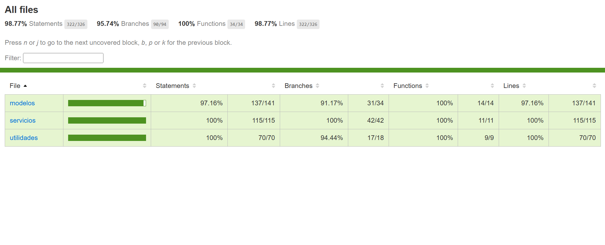

#### Justificación

**Qué cubren las pruebas:**

El `coverage.include` (en `vitest.config.js`) solo cubre la lógica de negocio, se excluyen configuraciones, migraciones y DTOs. El alcance que se mide es:

- **`cliente/utilidades/`:** `CalculadorPrecio.js` (cuotas, interés, subtotal, total con envío), `GestorStock.js` (regla de reposición por umbral), `GestorDevoluciones.js` (regla de plazo de 24 h) y `ActualizadorContador.js` (contador del carrito).

- **`cliente/servicios/`:** `CarritoServicio.js` (alta/edición/baja de ítems, totales y persistencia del carrito).

- **`cliente/modelos/`:** `ModeloCarrito.js` y `ModeloPedido.js` (eventos del carrito y del pedido, verificación de stock).

**La cobertura es alta porque:**

- `CalculadorPrecio`, `GestorStock` y `GestorDevoluciones` son funciones que solo toman datos y devuelven un resultado.
- `CarritoServicio` y los modelos se prueban con builders y mocks de servicios, sin usar `localStorage` ni la base de datos de Supabase.
- Cada rama de decisión (dentro/fuera de stock, dentro/fuera del plazo de 24 h, éxito/error del servicio) tiene su test.

**Qué no se cubre:**

- `cliente/vistas/` porque solo manipulan el DOM y no tienen reglas de negocio.
- `cliente/controladores/` porque solo conectan las vistas con modelos, sin lógica de negocio.
- `cliente/servicios/ClienteSupabase.js` y `servidor/` (routers de Express y repositorios) porque solo llaman a la base de datos o son infraestructura del framework, así que se mockean.
- Configuraciones (`vitest.config.js`, `eslint.config.js`) y DTOs, que la rúbrica excluye explícitamente.
- En `ModeloCarrito.js` quedan sin cubrir las llamadas a `window.showToast()` que avisan al usuario cuando un producto del carrito ya no tiene stock o cuando su cantidad se ajusto automáticamente. No se prueban porque `window.showToast` es código de la capa de presentación, no una regla de negocio.

---

## Sección 3 — Code smells corregidos

Mínimo 3 nuevos (adicionales a los del EC2).

| # | Tipo | Commit | Descripción |
|---|---|---|---|
| 1 | Variables mal declaradas / excepción ignorada | [`8f63137`](https://github.com/alejandroramirezucb/proyecto1-isw-213/commit/8f63137) | Antes `CarritoServicio` declaraba todo con `var` y el `catch (error)` recibía `error` sin usarlo, ahora usa `const`/`let` y `catch {}` sin parámetro |
| 2 | Números mágicos | [`7a99e8e`](https://github.com/alejandroramirezucb/proyecto1-isw-213/commit/7a99e8e) | Antes `ModeloCarrito` repetía el literal `6000` como duración del toast, ahora usa la constante `DURACION_TOAST_MS` |
| 3 | Código duplicado | [`405546b`](https://github.com/alejandroramirezucb/proyecto1-isw-213/commit/405546b) | Antes `ModeloCarrito` repetía el mismo `dispatchEvent('carrito:stockInsuficiente')` en 2 métodos, ahora ambos llaman `_emitirStockInsuficiente` |

### Detalle — Smell 1: Uso de `var` y excepción ignorada (`CarritoServicio.js`)

**Código antes:**
```javascript
obtenerCarrito() {
  try {
    var datos = localStorage.getItem(this.claveAlmacenamiento);
    if (!datos) return [];
    var carrito = JSON.parse(datos);
    return carrito.map(this._normalizarItem);
  } catch (error) {
    localStorage.removeItem(this.claveAlmacenamiento);
    return [];
  }
}
```

**Código después:**
```javascript
obtenerCarrito() {
  try {
    const datos = localStorage.getItem(this.claveAlmacenamiento);
    if (!datos) return [];
    const carrito = JSON.parse(datos);
    return carrito.map(this._normalizarItem);
  } catch {
    localStorage.removeItem(this.claveAlmacenamiento);
    return [];
  }
}
```

---

### Detalle — Smell 2: Número mágico (`ModeloCarrito.js`)

**Código antes:**
```javascript
async _verificarStock(carrito) {
  const promesas = carrito.map(async (item) => {
    try {
      const infoStock = await this._productoServicio.verificarStock(item.id);
      if (!infoStock.disponible || infoStock.stock === 0) {
        if (window.showToast) {
          window.showToast(`El producto "${item.nombre}" ya no está disponible y será eliminado del carrito.`, { tipo: 'warning', duracion: 6000 });
        }
        return null;
      }
      if (item.cantidad > infoStock.stock) {
        if (window.showToast) {
          window.showToast(`El producto "${item.nombre}" tiene menos stock. Se ajustó a ${infoStock.stock} unidades.`, { tipo: 'warning', duracion: 6000 });
        }
        item.cantidad = infoStock.stock;
      }
      item.stock = infoStock.stock;
      return item;
    } catch {
      return item;
    }
  });

  const resultados = await Promise.all(promesas);
  return resultados.filter((item) => item !== null);
}
```

**Código después:**
```javascript
const DURACION_TOAST_MS = 6000;

async _verificarStock(carrito) {
  const promesas = carrito.map(async (item) => {
    try {
      const infoStock = await this._productoServicio.verificarStock(item.id);
      if (!infoStock.disponible || infoStock.stock === 0) {
        if (window.showToast) {
          window.showToast(`El producto "${item.nombre}" ya no está disponible y será eliminado del carrito.`, { tipo: 'warning', duracion: DURACION_TOAST_MS });
        }
        return null;
      }
      if (item.cantidad > infoStock.stock) {
        if (window.showToast) {
          window.showToast(`El producto "${item.nombre}" tiene menos stock. Se ajustó a ${infoStock.stock} unidades.`, { tipo: 'warning', duracion: DURACION_TOAST_MS });
        }
        item.cantidad = infoStock.stock;
      }
      item.stock = infoStock.stock;
      return item;
    } catch {
      return item;
    }
  });

  const resultados = await Promise.all(promesas);
  return resultados.filter((item) => item !== null);
}
```

---

### Detalle — Smell 3: Código duplicado (`ModeloCarrito.js`)

**Código antes:**
```javascript
agregar(producto, cantidad) {
  const resultado = this._carritoServicio.agregarProducto(producto, cantidad || 1);
  if (resultado.exito === false) {
    document.dispatchEvent(new CustomEvent('carrito:stockInsuficiente', {
      detail: { productoId: producto.id, stockDisponible: producto.stock },
    }));
    return;
  }
  this._emitirModificado(resultado.carrito);
}

actualizarCantidad(idProducto, cantidad) {
  const resultado = this._carritoServicio.actualizarCantidad(idProducto, cantidad);
  if (resultado.exito === false) {
    document.dispatchEvent(new CustomEvent('carrito:stockInsuficiente', {
      detail: { productoId: idProducto, stockDisponible: resultado.carrito.find(i => i.id === idProducto)?.stock },
    }));
    return;
  }
  const carrito = Array.isArray(resultado) ? resultado : resultado.carrito;
  this._emitirModificado(carrito);
}
```

**Código después:**
```javascript
agregar(producto, cantidad) {
  const resultado = this._carritoServicio.agregarProducto(producto, cantidad || 1);
  if (resultado.exito === false) {
    this._emitirStockInsuficiente(producto.id, producto.stock);
    return;
  }
  this._emitirModificado(resultado.carrito);
}

actualizarCantidad(idProducto, cantidad) {
  const resultado = this._carritoServicio.actualizarCantidad(idProducto, cantidad);
  if (resultado.exito === false) {
    this._emitirStockInsuficiente(idProducto, resultado.carrito.find(i => i.id === idProducto)?.stock);
    return;
  }
  const carrito = Array.isArray(resultado) ? resultado : resultado.carrito;
  this._emitirModificado(carrito);
}

_emitirStockInsuficiente(productoId, stockDisponible) {
  document.dispatchEvent(new CustomEvent('carrito:stockInsuficiente', {
    detail: { productoId, stockDisponible },
  }));
}
```

---

## Sección 4 — Trazabilidad HU → CA → test

| # | Historia de Usuario | Criterio de Aceptación | Prueba que valida ese CA | Commit |
|---|---|---|---|---|
| 1 | HU-02 Pago flexible por cuotas | Mostrar el monto de cada cuota y el interés antes de confirmar | `aplica el interés al total antes de dividir entre las cuotas` | [`1a305e6`](https://github.com/alejandroramirezucb/proyecto1-isw-213/commit/1a305e6) |
| 2 | HU-12 Alerta de Stock Mínimo | Cuando el stock llegue a una cantidad, alertar | `marca reposición cuando el stock está en el umbral` | [`67628ed`](https://github.com/alejandroramirezucb/proyecto1-isw-213/commit/67628ed) |
| 3 | HU-03 Solicitud de devolución | Más de 24 h desde la entrega → opción deshabilitada | `rechaza la devolución cuando han pasado exactamente 24 horas` | [`1068f6c`](https://github.com/alejandroramirezucb/proyecto1-isw-213/commit/1068f6c) |

### Cadena 1 — HU-02 Pago flexible por cuotas

**Historia de Usuario:**
> Como cliente, quiero seleccionar la opción de pago en cuotas al finalizar mi compra para adquirir productos de mayor valor sin tener el dinero suficiente en ese momento.

**Criterio de Aceptación elegido:**
> Dado que el cliente está en la pasarela de pagos, cuando seleccione "Pago en cuotas", entonces el sistema debe mostrar el monto de cada cuota y el interés (si existe) antes de confirmar.

**Prueba que valida este CA:**
```javascript
it('aplica el interés al total antes de dividir entre las cuotas', () => {
  // Arrange: precio = 1000, numeroCuotas = 10, interes = 0.2 
  // Act
  const resultado = CalculadorPrecio.calcularCuotaConInteres(1000, 10, 0.2);

  // Assert
  expect(resultado).toBe('120.00');
});
```

---

### Cadena 2 — HU-12 Alerta de Stock Mínimo

**Historia de Usuario:**
> Como administrador, quiero recibir notificaciones automáticas cuando un producto tenga pocas unidades en el stock para realizar la reposición a tiempo y no perder ventas.

**Criterio de Aceptación elegido:**
> Dado que el inventario disminuye por cada venta, cuando el stock llegue a una cantidad, entonces el sistema debe enviar un correo o alerta al panel de administración.

**Prueba que valida este CA:**
```javascript
it('marca reposición cuando el stock está en el umbral', () => {
  // Arrange: stock = 5, umbral = 5 
  // Act
  const resultado = GestorStock.requiereReposicion(5, 5);

  // Assert
  expect(resultado).toBe(true);
});
```

---

### Cadena 3 — HU-03 Solicitud de devolución

**Historia de Usuario:**
> Como cliente, quiero solicitar la devolución de un producto dentro de las 24 horas para obtener un reembolso cumpliendo con las políticas de Raiden Corp. (factura y producto intacto).

**Criterio de Aceptación elegido:**
> Dado que han pasado más de 24 horas, cuando el cliente entre a su pedido, entonces el sistema debe deshabilitar automáticamente la opción de devolución, indicando que el plazo ha vencido.

**Prueba que valida este CA:**
```javascript
it('rechaza la devolución cuando han pasado exactamente 24 horas', () => {
  // Arrange
  const entrega = new Date('2026-06-18T08:00:00Z');
  const ahora = new Date('2026-06-19T08:00:00Z');

  // Act
  const resultado = GestorDevoluciones.puedeSolicitar(entrega, ahora);

  // Assert
  expect(resultado).toBe(false);
});
```
